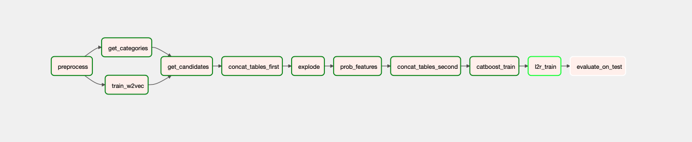
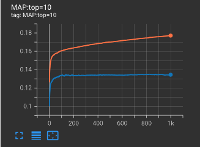
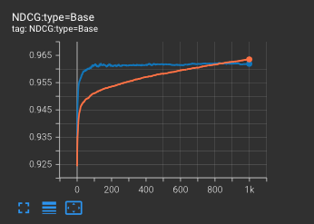
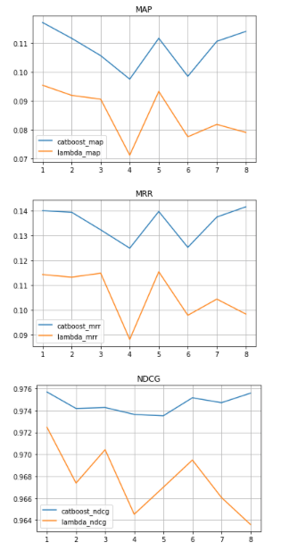

Этот репозиторий про session based рекомендательную систему.

Используем item-based подход, т.к. нет привязки сессиий к пользователям.
Для запуска пайлайна используется Airflow -- инструмент, позволяющий строить направленный ацикличный граф из python-скриптов.

В данном случае граф выглядит следующим образом:

и представляет собой несколько этапов, где каждый зависит от предыдущего.

Можно разделить пайплайн на две части:
- ETL (Extract->Transform->Load)
- L2R (Learning to Rank)

На первом этапе происходит обработка сырых данных сессий и подбор кандидатов под второй этап. Здесь используются алгоритмы поиска ближайших соседей и языковые модели для получения векторных представлений по тексту. Здесь для каждой сессии подбираются N рекомендаций.

На втором этапе происходит ранжирование N кандидатов внутри одной сессии. Необходимо определить наиболее релевантные товары и показать их раньше (выше) других.

На втором этапе используются методы обучения ранжированию в машинном обучении:
- YetiRank (CatBoost)
- LambdaRank на Pytorch

В конце происходит сравнение двух методов по ключевым для ранжирования метрикам -- NDCG, mAP@K, MRR.

Ниже представлены метрики во время обучения для CatBoost.

`train - orange, val - blue`

После обучения моделей производится их сравнение на тестовом наборе данных, который выбирается случайным образом до обучения моделей и обработки данных.

Итоговые метрики на тестовом датасете:

